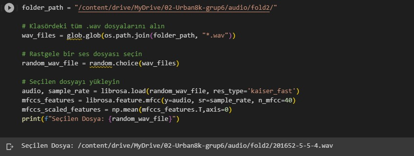
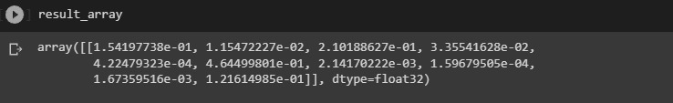
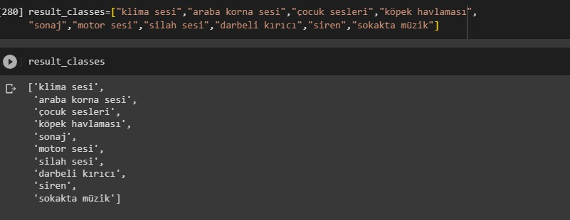
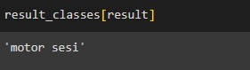
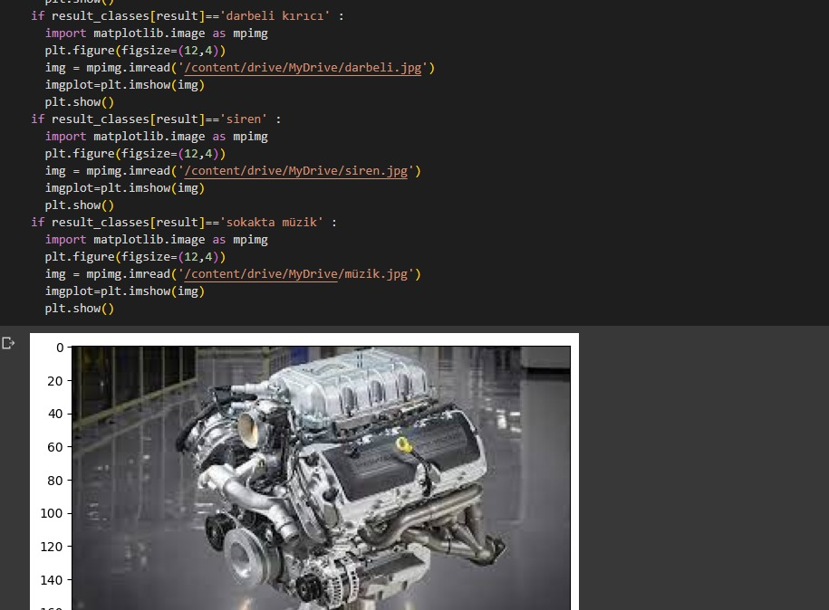
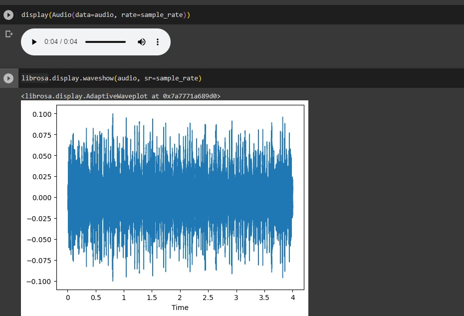

# Ses Sınıflandırma Projesi

Bu proje, ses verilerini alarak çeşitli ses sınıflarına tahmin etmek için bir makine öğrenimi modeli oluşturmayı içerir. Ses sınıfları arasında "klima sesi", "araba korna sesi", "çocuk sesleri", "köpek havlaması", "sonaj", "motor sesi", "silah sesi", "darbeli kırıcı", "siren" ve "sokakta müzik" yer alır.

## Proje Hedefleri

- Ses dosyalarını MFCC (Mel-Frequency Cepstral Coefficients) özelliklerine dönüştürmek.
- Oluşturulan özellikleri kullanarak bir makine öğrenimi modeli eğitmek.
- Modeli eğitim verileri üzerinde değerlendirmek ve doğruluk sonuçlarını almak.
- Rastgele seçilen ses dosyalarını tahmin etmek ve sonuçları ekrana yazdırmak.

## Kullanılan Teknolojiler

- Python
- Jupyter Notebook
- Google Colab
- librosa (ses işleme kütüphanesi)
- Scikit-learn (makine öğrenimi kütüphanesi)

## Nasıl Çalıştırılır

1. Proje dosyalarını indirin ve Jupyter Notebook veya Google Colab'da açın.
2. `model.ipynb` dosyasını açın ve tüm hücreleri çalıştırın.
3. Model, önceden eğitilmiş verilerle eğitilecektir. Test veri kümesi üzerinde doğruluk sonuçları elde edeceksiniz.
4. Rastgele bir ses dosyası seçilerek model tarafından tahmin edilecektir. Sonuç ekrana yazdırılacaktır.

## Veri Kümesi

Ses sınıflandırma için kullanılan veri kümesi UrbanSound8K'dan alınmıştır. Bu veri kümesi, 10 farklı ses sınıfından toplamda 8732 ses örneği içerir. Eğitim için kullanılan dosyalar, ses sınıflarına göre alt klasörlere ayrılmıştır.

## Örnek Sonuç

Seçilen Dosya: /content/drive/MyDrive/02-Urban8k-grup6/audio/fold2/104817-4-0-0.wav
Tahmin: klima sesi

